# Midterm Chatroom

A React + Firebase "Messenger" like chatroom application for the Software Studio midterm project.
Users can register, sign in, create private or group chatrooms, invite members,
send realtime messages, manage profiles, and use several message operations.

## Project Completion Status

| Category | PPT Criteria | Score | Status | Implementation Notes |
| --- | --- | --- | --- | --- |
| Basic | Email sign up / email sign in | 5% | Completed | Firebase Authentication supports email registration and login. |
| Basic | Firebase Hosting | 5% | Completed | `firebase.json` is configured to deploy the Vite build output from `dist`. |
| Basic | Authenticated database read/write | 5% | Completed | Firestore stores users, chatrooms, members, messages, reactions, read status, and block lists. |
| Basic | RWD | 5% | Completed | The chatroom UI includes responsive sidebar/chat layouts for desktop and mobile screens. |
| Basic | Git version control | 5% | Completed | The project is managed with Git commits during development. |
| Basic | Chatroom core features | 25% | Completed | Users can create private/group chatrooms, invite members, send realtime messages, and load chat history. |
| Advanced | React framework | 5% | Completed | The project is implemented with React. |
| Advanced | Google sign in | 1% | Completed | Google sign-in is available. |
| Advanced | Chrome notification | 5% | Completed | Notifications are sent for unread incoming messages, with an app-level notification toggle. |
| Advanced | CSS animation | 2% | Completed | Login/register pages include animated background shapes and cursor glow effects. |
| Advanced | Handle code-like message text | 2% | Completed | Message text is rendered as React text content, so HTML/script-like input is not executed. |
| Advanced | User profile | 10% | Completed | Users can edit profile picture, username, email, phone number, and address in a modal. |
| Advanced | Message operations | 10% | Completed | Users can edit/unsend own messages, search text messages, send images, and unsend own images. |
| Bonus | Block user | 2% | Completed | Direct messages are disabled between blocked users, and group messages are mutually hidden. |
| Bonus | Message emoji reaction | 3% | Completed | Users can add, change, remove, and view emoji reactions on messages. |
| Bonus | Reply to specific message | 6% | Completed | Users can reply to messages, preview the reply target, scroll to the original message, and highlight it. |

## Features

### Authentication

- Email sign up
- Email sign in
- Google sign in

### Chatroom basic functions
Click the `New Chat` button to open create chatroom modal.


- Create private chatrooms with registered users.
  1. Select 1 registered user. (search availible)
  2. Click `start private chat` button.

  

- Create group chatrooms with selected members.
  1. Select members you want to add in this groupchat from registered users. (search availible)
  2. Click `Create Chatroom` button.

  

- Invite more members to existing group chatrooms.
  1. Select the chatroom from `mychatrooms` panel

  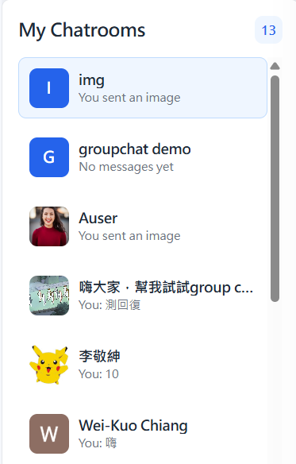

  2. click the gear shape `room settings` button in the top right corner of the Current chatroom panel. 

  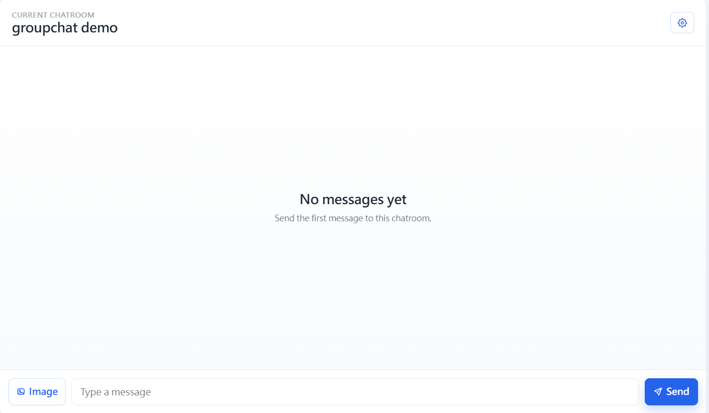

  3. Click `manage members` button.

  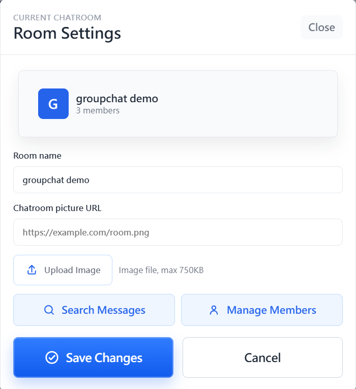

  4. select members you want to add to this chatroom. Then click add member.

  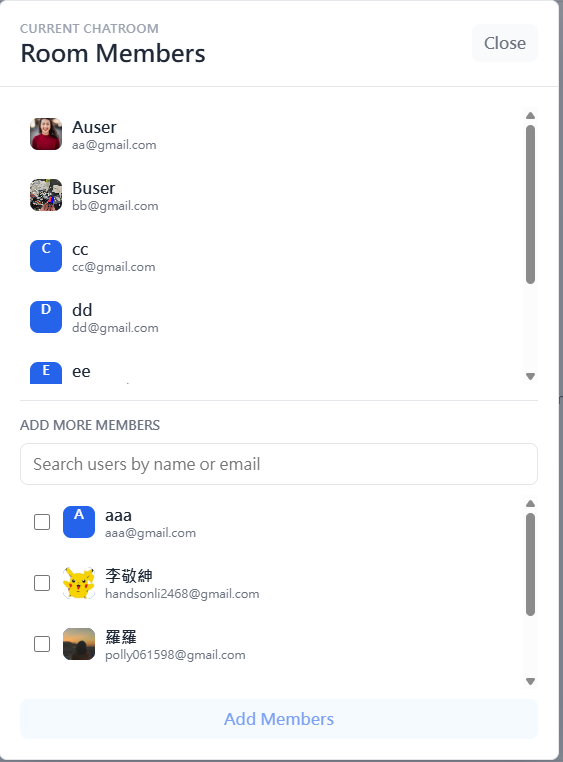

- Realtime room list and message updates with Firestore subscriptions.
- Load full message history for the current chatroom.
- Room settings for group room name and room picture.

  

- Private chat display uses the other user's profile information.(room picture and room name)

### User Profile

Click the signed-in profile area in the upper-left panel to edit your profile.


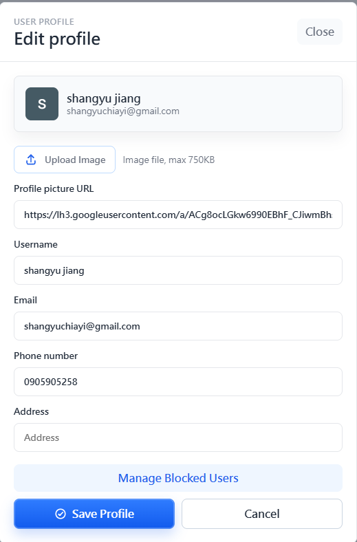

The editable fields are:
- Profile picture URL or uploaded image
- Username
- Email
- Phone number
- Address

Usernames, emails, and profile pictures are shown in chatroom UI where relevant.

To check other users' profile, click on their profile picture in chatrooms. 
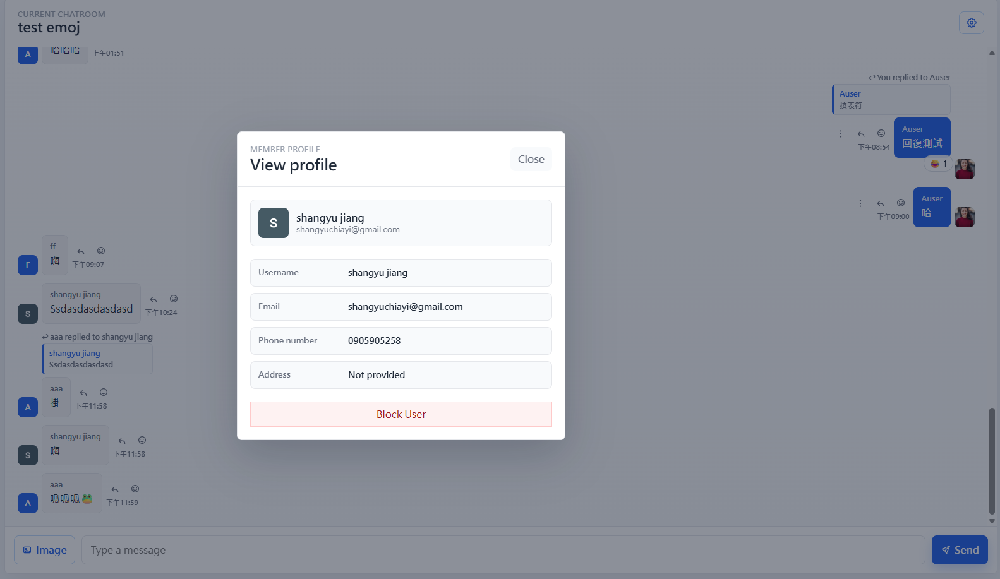

### Message operations

- Send text messages.
- Send image messages by upload or paste.
- Preview and download sent images.
  1. click on the image in chatroom to preview.
  2. click the `download` button to download or `close` to exit preview(both button are in the to right corner).
  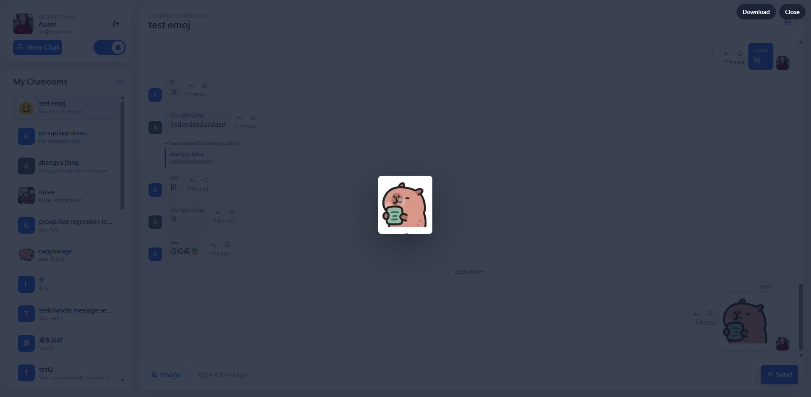
- Edit your own text messages.
- Unsend your own text or image messages.

  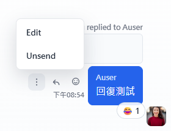

- Search messages in the current chatroom and jump to a result.
  1. Click `room settings` button to open room setting modal
  2. Click `Search Messages`

  

  3. Type the message you want to search in the search bar and click on the message to go to the selected mesage in this chatroom.

  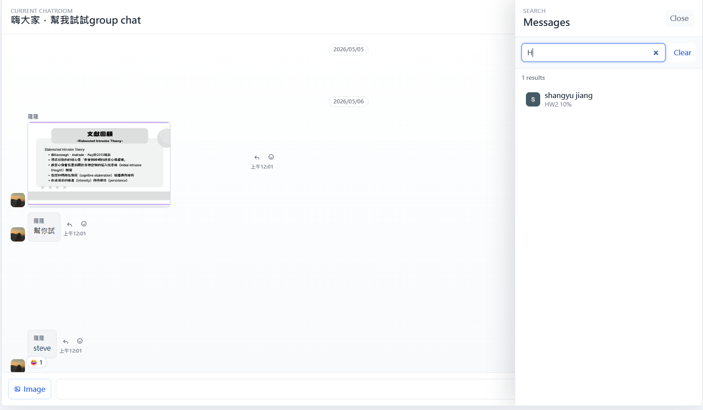

  Same steps for private chatrooms.


- Reply to a specific message. (Bonus)
  click on the middle UI butoon of the three buttons on the side of a dialog bubble

  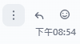
  
- Show the reply target above the composer while typing. (Bonus)
- Click a replied message preview to scroll to and highlight the original message. (Bonus)  

- Add an emoji reaction to a message. (Bonus)

  

- Change or remove your own reaction by clicking another emoji or click the same emoji again. (Bonus)
- View reaction counts and users by clicking on the emoji bubble. (Bonus)

  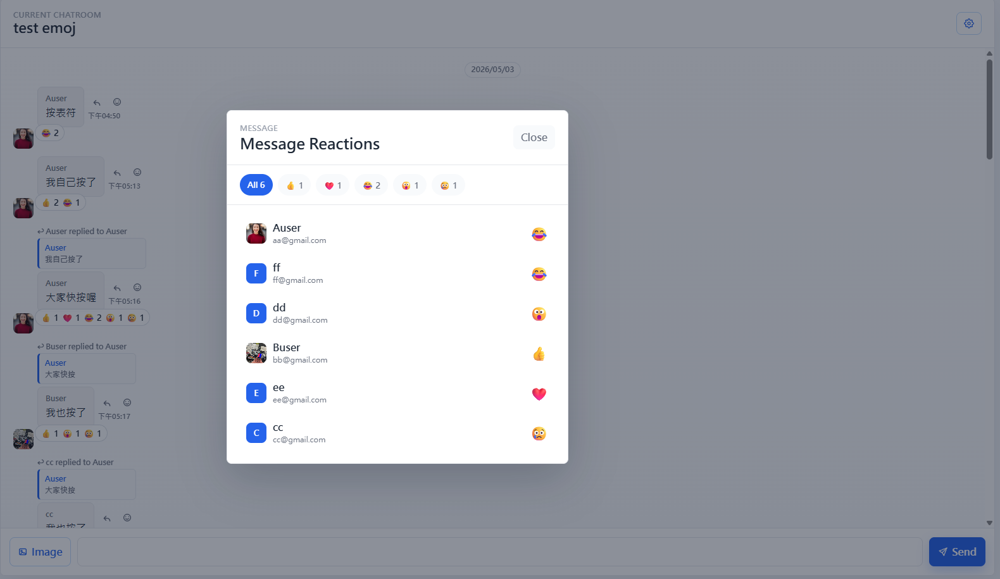

### Notifications

- Chrome notification support for unread incoming messages.
- Notifications are only sent for messages from other users.
- If the current tab is visible and focused on the active room, the app does not
  send a duplicate browser notification.
- App-level notification toggle is available in the profile panel.

  

- Unread chatroom count is shown as a badge when notifications are enabled.

  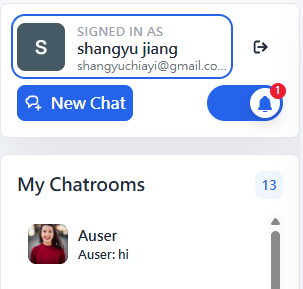

### CSS Animation

The login and register page include CSS animations in the background. The large
soft background shapes use `authBlobFloatLeft` and `authBlobFloatRight`, and the
smaller circles use `authFloat` and `authPulse` to create continuous motion.

The page also tracks the mouse position and updates CSS variables for
`auth-cursor-glow`, so moving the cursor creates a soft trailing light effect
behind the authentication card.

### Block User(Bonus)

- View another member's profile from the chat UI.
- Block or unblock users from the profile modal.

  

- Manage all blocked users in the edit profile modal.

  

  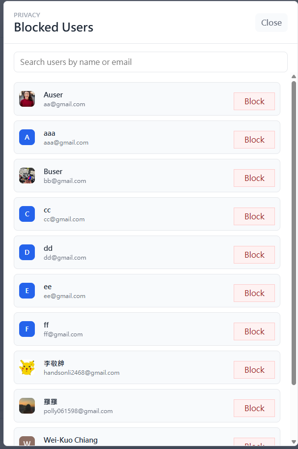

- Block/unblock a user in the private chat `room settings`.

  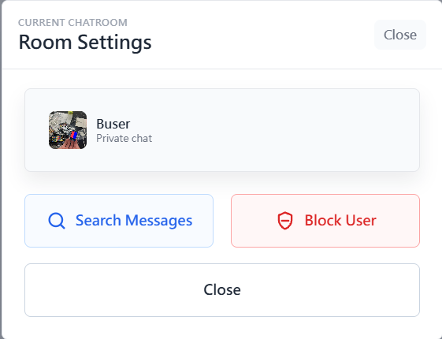


- If User A blocks User B, direct messages between them are disabled.
- Existing private chat history remains visible with a warning.
- In group chatrooms, messages between blocked users are mutually hidden.

### Responsive UI

- The app uses a responsive sidebar/chat layout.
- On small screens, the room list and active chat view switch between mobile
  states so the main controls remain usable.


## Local Setup

Clone this project

```bash
git clone <url>
```

Open the project directory

```bash
cd ChatRoom
```

npm install

```bash
npm install
```
Start the local development server:

```bash
npm run dev
```

Then open the Vite local URL shown in the terminal, usually:

```text
http://localhost:5173
```
