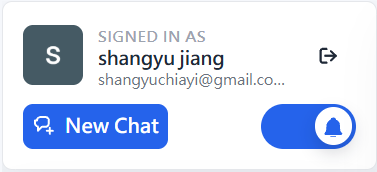
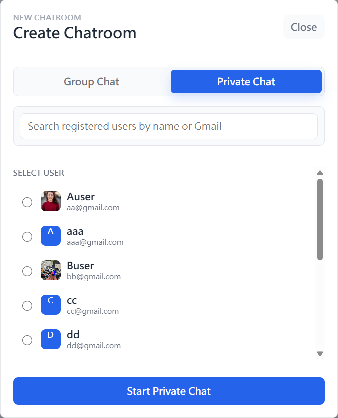
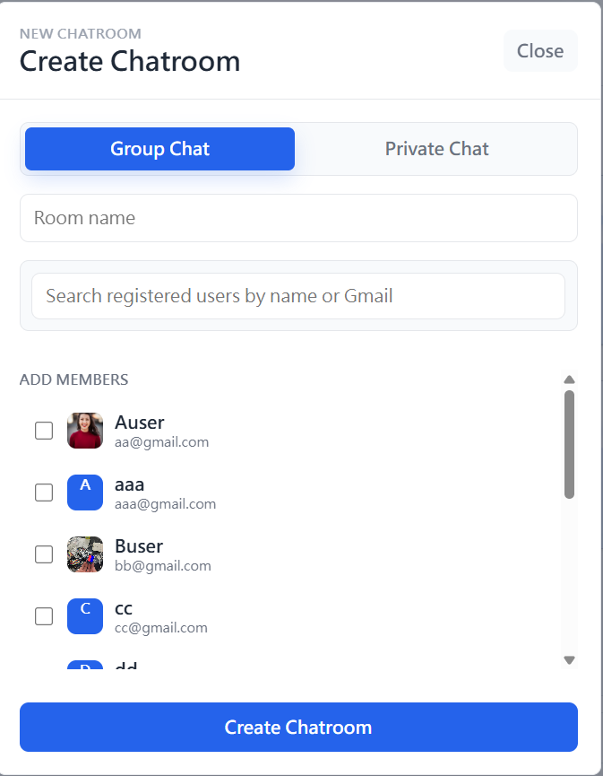

# Midterm Chatroom

A React + Firebase chatroom application for the Software Studio midterm project.
Users can register, sign in, create private or group chatrooms, invite members,
send realtime messages, manage profiles, and use several message operations.

## Features

### Authentication

- Email sign up
- Email sign in
- Google sign in

### Chatrooms
Click the "New Chat" button to open create chatroom modal.



- Create private chatrooms with registered users.
  1. select 1 registered user. (search availible)
  2. click "start private chat" button<br>

  

- Create group chatrooms with selected members.

  

- Invite more members to existing group chatrooms.
- Realtime room list and message updates with Firestore subscriptions.
- Load full message history for the current chatroom.
- Room settings for group room name and room picture.
- Private chat display uses the other user's profile information.

### User Profile

Click the signed-in profile area in the upper-left panel to edit your profile.
The editable fields are:

- Profile picture URL or uploaded image
- Username
- Email
- Phone number
- Address

Usernames, emails, and profile pictures are shown in chatroom UI where relevant.

### Messages

- Send text messages.
- Send image messages by upload or paste.
- Preview and download sent images.
- Edit your own text messages.
- Unsend your own text or image messages.
- Search messages in the current chatroom and jump to a result.
- Reply to a specific message.
- Show the reply target above the composer while typing.
- Click a replied message preview to scroll to and highlight the original message.
- Add an emoji reaction to a message.
- Change or remove your own reaction.
- View reaction counts and users.

### Notifications

- Chrome notification support for unread incoming messages.
- Notifications are only sent for messages from other users.
- If the current tab is visible and focused on the active room, the app does not
  send a duplicate browser notification.
- App-level notification toggle is available in the profile panel.
- The notification toggle state is saved in `localStorage`.
- Unread chatroom count is shown as a badge when notifications are enabled.

### Block User

- View another member's profile from the chat UI.
- Block or unblock users from the profile modal.
- If User A blocks User B, direct messages between them are disabled.
- Existing private chat history remains visible with a warning.
- In group chatrooms, messages between blocked users are mutually hidden.

### Responsive UI

- The app uses a responsive sidebar/chat layout.
- On small screens, the room list and active chat view switch between mobile
  states so the main controls remain usable.

## How To Use

### Register and Login

1. Open the app.
2. Select `Create account` to register with email and password.
3. Use `Sign in` for email login.
4. Use `Sign in with Google` for Google login.

### Edit Profile

1. After login, click your profile area in the upper-left panel.
2. Edit your profile picture, username, email, phone number, or address.
3. Click `Save Profile`.

### Create a Private Chat

1. Click `New Chat` in the upper-left panel.
2. Select `Private`.
3. Choose one registered user.
4. Click `Start Private Chat`.

### Create a Group Chat

1. Click `New Chat` in the upper-left panel.
2. Select `Group`.
3. Enter a room name.
4. Select members from the registered user list.
5. Click `Create Chatroom`.

### Invite Members

1. Open a group chatroom.
2. Open `Room Settings`.
3. Click `Manage Members`.
4. Select more users and click `Add Members`.

### Send Messages

- Type text in the message input and press `Send`.
- Click the image button to upload an image.
- Paste an image into the message input area to send it as an image message.
- Image files must be 750KB or smaller.

### Message Operations

- Use the message action buttons next to a message.
- You can edit or unsend only your own messages.
- Click reply on a message to reply to it.
- Use the search button in room settings to search current room messages.
- Use emoji reaction buttons to add, change, or remove your reaction.

### Notifications

1. Click the notification toggle in the upper-left panel.
2. If Chrome asks for permission, allow notifications.
3. Click the toggle again to turn app notifications off or on.

Chrome notification permission is controlled by the browser. The app toggle only
controls whether this chatroom app sends notifications after permission is
granted.

### Block and Unblock Users

1. Click another user's avatar/profile in the chat UI.
2. Click `Block User` to block them.
3. Click `Unblock User` to allow chat again.

## Local Setup

Install dependencies:

```bash
npm install
```

Start the local development server:

```bash
npm run dev
```

Then open the Vite local URL shown in the terminal, usually:

```text
http://localhost:5173
```

Build production files:

```bash
npm run build
```

Preview the production build locally:

```bash
npm run preview
```

Run lint:

```bash
npm run lint
```

If PowerShell blocks `npm.ps1`, use `npm.cmd` instead:

```powershell
npm.cmd install
npm.cmd run dev
npm.cmd run build
npm.cmd run preview
npm.cmd run lint
```

## Firebase Hosting

This project is configured for Firebase Hosting in `firebase.json`.
The hosting public directory is `dist`.

Build before deployment:

```bash
npm run build
```

Deploy to Firebase Hosting:

```bash
firebase deploy
```

## Notes

- Firebase config is defined in `src/firebase/firebase.js`.
- Firestore is used for users, chatrooms, room membership, and messages.
- Image messages and uploaded profile/room pictures are stored as base64 data in
  Firestore fields.
- The app does not implement chatbot, Tenor GIF, or custom sticker features.
- If an AI usage report is required, provide `AI_reference.pdf` in the project
  root separately.
